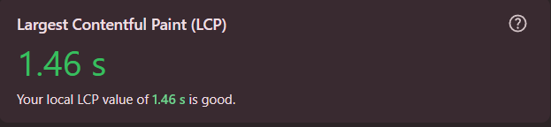
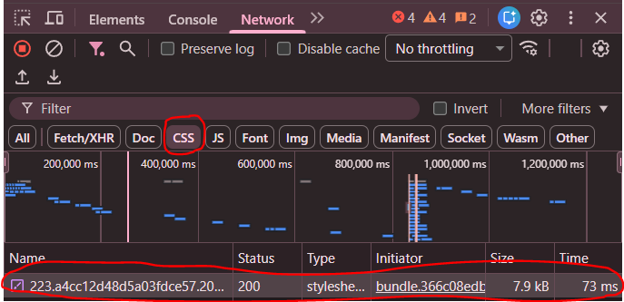
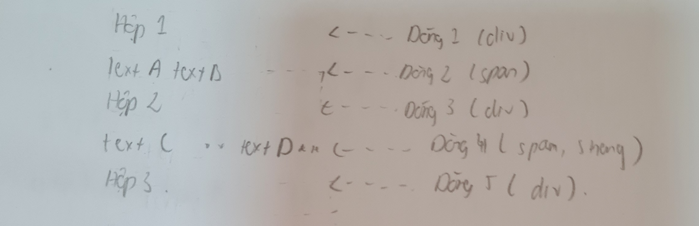

CÂU A1:
    1.
        Khi ta mở chrome và gõ https://shopee.vn sau đó nhấn phím enter.
            1.Request xuất phát từ máy tính cá nhân -> đi qua router wifi  
            -> Qua nhà mạng -> chạy qua cáp quang 
            2. -> Đến data center của Shopee ở Việt Nam
            3. -> Server xử lý: "Tôi muốn truy cập trang chủ Shopee"
            4. -> Response chạy ngược lại: cáp quang -> nhà mạng -> router -> máy tính cá nhân
            5. -> Chrome nhận file HTML,CSS,JS -> render ra giao diện -> thấy trang chủ của shopee
    2.
        
        Status code của request đầu tiên: 200 (Thành công và trả về kết quả)
        
        Tổng thời gian load trang: 1.46 giây
        
        Request trả về file CSS trong đó : status code: 200 (Thành công và trả về kết quả), thời gian thực hiện của request: 73ms
CÂU A2:
    +Tại sao trang web bị Google đánh giá SEO thấp?
        Vì đoạn code sử dụng thẻ 
 cho mọi thứ thay vì semantic tags.
        -> Google không thể hiểu cấu trúc trang -> xếp hạng thấp trong kết quả tìm kiếm
    + 4 lỗi semantic:
        -Lỗi 1: dòng 
 thay vì <header> khiến cho google không thể nhận diện phần header
        -Lỗi 2: dòng 
 và 
<a> thay vì <nav>
            + Vấn đề: Menu không được đánh dấu sementic 
            + Sửa: <nav><ul><li><a>...</a></li></ul></nav>
        -Lỗi 3: dòng 
 thay vì <main>
            + Vấn đề: Nội dung chính không được xác định
            + Sửa: <main>...</main>
        -Lỗi 4: 
 + 
 thay vì <article> + <h2>
            - Vấn đề: Sản phẩm không cấu trúc đúng, không hỗ trợ schema.org/Product 
    -Đoạn code sau khi đã sửa: 
        <header>
            
ShopTLU

            <nav>
            <ul>
                <li><a href="/">Trang chủ</a></li>
                <li><a href="/products">Sản phẩm</a></li>
            </ul>
            </nav>
        </header>   

        <main> 
            <article class="product">
                <h2>iPhone 16 Pro</h2>
                <figure></figure>
                
25.990.000đ

            </article>
        </main>

        <footer> 
             
&copy; 2026 ShopTLU

        </footer>

CÂU A3:
    

    Giải thich:
    - 
: Chiếm cả dòng có thể xuống dòng mới và điều chỉnh chiều rộng,dài
    - : Chỉ chiếm phần nội dung,nằm cùng dòng với nhau
    - <strong> : Chỉ chiếm phần nội dung,nằm cùng dòng với nhau,in đậm để nhấn mạnh nội dung

